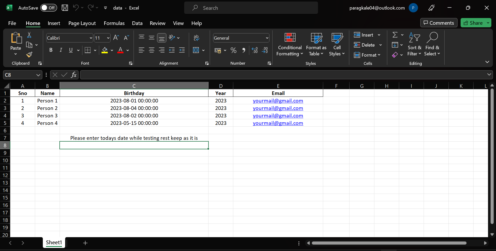
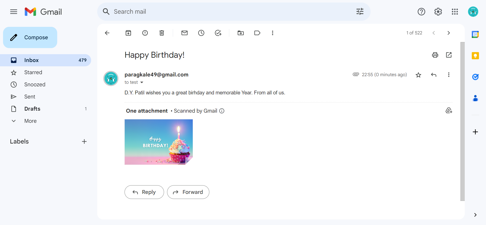

Hello!  
• This is an Automatic email-sending tool that sends emails by scanning the Excel sheet if today's date and action date in Excel match.  
• Specifically, the action date here is the birth date of the alumni, So when we run our program and if today's date is the birth date of the alumni then greet mail 
  automatically send to alumni with just one click.  
  • This project was made with Python and Flask at the backend and HTML, CSS, and Tailwind CSS for the backend.  

  ## <picture></picture> Preview of Project

  1 - When We open the Website it will look like this.  
    
  
    

  2 - Our Excel sheet must look like this. All the column names should be as it is. Please ensure that in the birthday column, you should write the action date.  
     
  
    

  3 - When we click on sends email now button then we get mail like this.  
     
  
    

   4 - When all the birthday wishes are sent the page will look like this. 
     
  
    

  If you ever get stuck on this project do mail us at **paragkale49@gmail.com**  

  
  <b> Thank You ❤️</b> 

   

  
